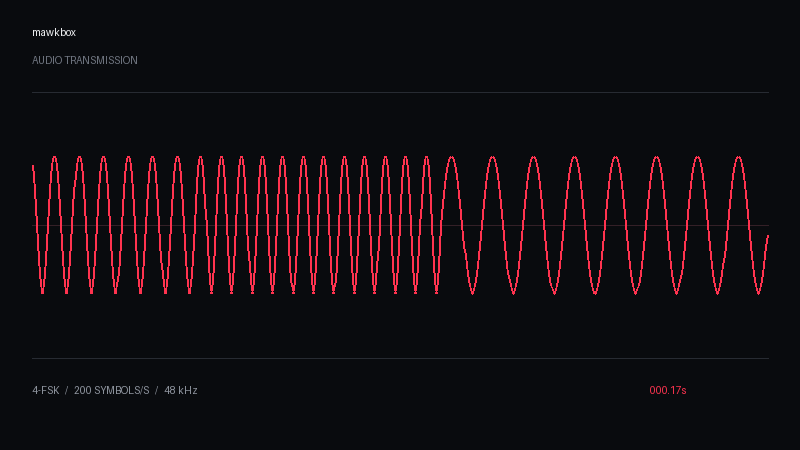

# mawkbox

A small local workspace for turning words into signal traffic, exporting that signal as **WAV + MP4**, and recovering the words from either file.

One name. One message. One red signal line.



## Run

Requires Python 3.10+, Tk, and FFmpeg (including its H.264 and AAC encoders).

```sh
git clone https://github.com/chasebryan/mawkbox.git
cd mawkbox
python3 -m venv .venv
source .venv/bin/activate
python -m pip install .
mawkbox
```

On macOS with Homebrew Python 3.14, install the system prerequisites first:

```sh
brew install python-tk@3.14 ffmpeg
```

The Tk package must match the Python major/minor version used by the virtual environment (`python --version`). For example, Python 3.13 needs `python-tk@3.13`. Homebrew supplies Tk separately from Python; it is not a pip dependency. If mawkbox reports `No module named '_tkinter'` or `No module named 'tkinter'`, install the matching Homebrew Tk package, verify with `python -m tkinter` (close its test window), then run `mawkbox` again. An existing virtual environment normally needs no reinstall for this missing module. If Homebrew upgrades or replaces its base Python and the environment no longer runs, recreate the environment and reinstall mawkbox.

On Fedora, install the system prerequisites with `sudo dnf install python3-tkinter ffmpeg-free`. If that FFmpeg build lacks `libx264`, install a build with H.264 encoding support before exporting video. On Debian/Ubuntu: `sudo apt install python3-tk python3-venv ffmpeg`. Windows needs a Python installation with Tcl/Tk support enabled and `ffmpeg` available on PATH.

The desktop window contains a message editor, a red signal scope, a passphrase field, audio/video exports, and a file decoder. Encryption is selected by default. Choose **Plain encoding (no secrecy)** only when secrecy is unnecessary. Retain the passphrase separately: mawkbox cannot recover a lost one.

- **Export WAV** writes `.wav` and `.mawkbox` files.
- **Export MP4 + WAV** writes `.mp4`, `.wav`, and `.mawkbox` files.
- **Decode file** opens any of those formats and recovers its message in the editor. Enter the original passphrase first for an encrypted transmission.

The scope and video show samples from the actual encoded audio. The message and passphrase do not appear in the video. Files are processed locally; no accounts or network services are used.

## CLI

```sh
# Opens the same desktop window
python -m mawkbox

# Prompts for the passphrase, keeping it out of shell history
mawkbox encode "Good morning, NSA." --video -o transmission
mawkbox decode transmission.mp4
mawkbox decode transmission.wav
mawkbox decode transmission.mawkbox

# Explicitly unencrypted
mawkbox encode "Hello" --plain --video -o hello
mawkbox decode hello.mp4 --plain
```

## Format and limits

The [format specification](FORMAT.md) defines the binary frame and four audio tones. Encrypted frames use **ChaCha20-Poly1305**, a fresh random salt and nonce, and a passphrase-derived key using scrypt. The encryption implementation comes from `cryptography`; modulation itself offers no secrecy. Plain frames have a CRC for accidental damage, not authentication.

Version 0.1 supports up to **4096 UTF-8 bytes** per message. Audio is mono, 48 kHz, with 200 four-tone symbols per second (400 bits/s). MP4 uses H.264 video and AAC audio. The decoder reads the audio track; it does not need video metadata or sidecar files.

This is a first file-transport implementation, **not a tested radio or acoustic modem**. Original exports round-trip through AAC. Synchronization searches within the first two seconds, and input audio is limited to 90 seconds. Microphone recordings, noisy radio channels, time stretching, trimming, and social-media recompression are not guaranteed. No forward error correction is implemented. Strong passphrases matter because a captured frame permits offline password guessing. Duration reveals approximate message length.

## Verify

```sh
python -m unittest discover -s tests -v
```

Tests cover Unicode and empty messages, maximum message size, randomized encryption, wrong passphrases, CRC damage, authenticated tampering, leading silence/gain/noise, and recovery from encrypted WAV and AAC MP4 exports. The desktop smoke test runs when a display is available; CI uses Xvfb.

Licensed under the repository's [GPLv3 license](LICENSE).
